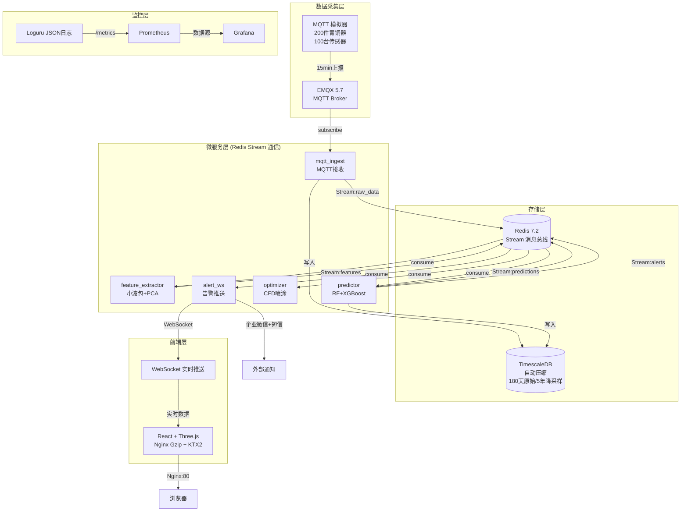
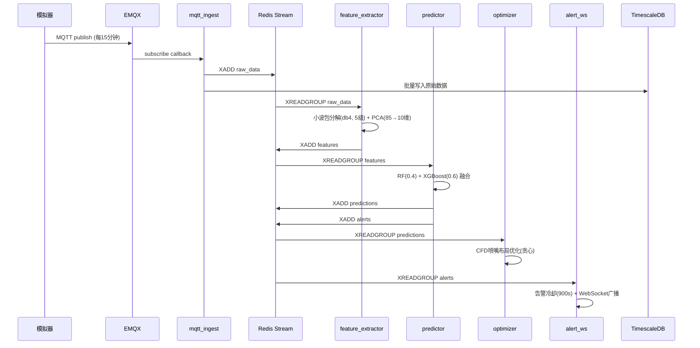
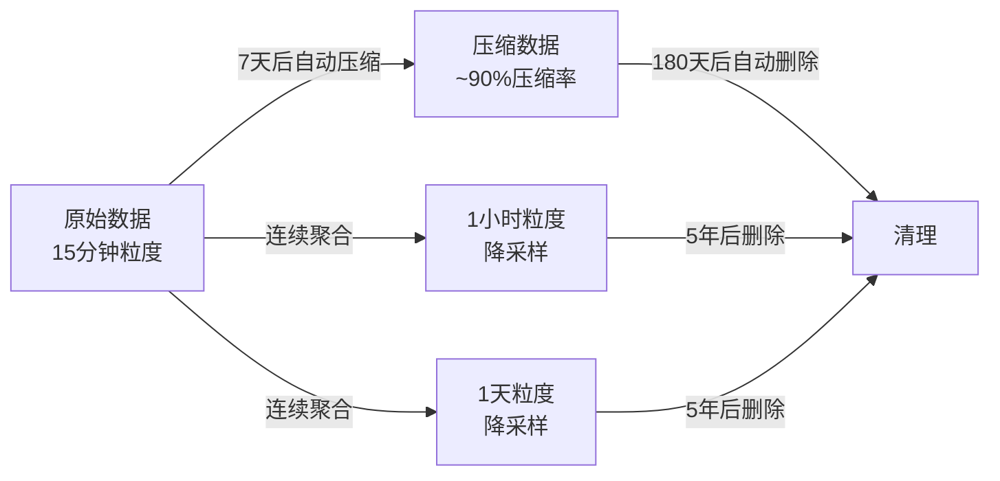

# 古代青铜器粉状锈爆发预警与缓蚀剂智能喷涂系统

> 基于 **小波包分解 + PCA降维 + RF/XGBoost融合预测** 的粉状锈爆发预警系统，结合 CFD 简化模型的缓蚀剂(BTA/AMT/MBO)智能喷涂优化。

## 架构总览



## 数据流



## 快速部署

### 前置条件

- Docker 24+ & Docker Compose v2.20+
- 至少 8GB RAM, 20GB 磁盘

### 1. 克隆 & 配置

```bash
git clone <repo-url>
cd bronze-rust-alert

# 可选：修改密码
cp .env.example .env
# 编辑 .env 设置 DB_PASSWORD, GRAFANA_PASSWORD 等
```

### 2. 一键启动

```bash
# 启动核心服务（TimescaleDB + EMQX + Redis + Backend + Frontend）
docker compose up -d

# 等待所有服务健康
docker compose ps
```

### 3. 启动模拟器

```bash
# 基础模式（200件青铜器，15分钟间隔）
docker compose --profile simulator up -d simulator

# 启用点蚀注入 + 高Cl⁻尖峰
INJECT_PITTING=1 INJECT_CL_PEAK=1 docker compose --profile simulator up -d simulator

# 快速模式（10秒间隔，用于调试）
docker compose run --rm -e REPORT_INTERVAL=10 simulator
```

### 4. 启动监控（可选）

```bash
docker compose --profile monitoring up -d
# Grafana: http://localhost:3000 (admin/Grafana@2026!)
# Prometheus: http://localhost:9091
```

### 5. 验证

```bash
# 健康检查
curl http://localhost:8000/api/health

# 查看实时数据
curl http://localhost:8000/api/artifacts/realtime/all

# 前端
open http://localhost
```

## 模拟器配置

| 环境变量 | 默认值 | 说明 |
|---------|--------|------|
| `NUM_ARTIFACTS` | `200` | 模拟青铜器数量 |
| `REPORT_INTERVAL` | `900` | 上报间隔（秒），15分钟=900 |
| `INJECT_PITTING` | `0` | **设为 `1` 启用点蚀尖峰注入** |
| `INJECT_CL_PEAK` | `0` | **设为 `1` 启用高Cl⁻浓度尖峰** |
| `PEAK_INTERVAL_HOURS` | `6` | Cl⁻尖峰注入周期（小时） |
| `SEED` | `42` | 随机种子（可重复性） |
| `MQTT_BROKER` | `emqx` | MQTT Broker 地址 |
| `MQTT_PORT` | `1883` | MQTT Broker 端口 |
| `LOG_LEVEL` | `INFO` | 日志级别 |

### 注入模式示例

```bash
# 仅点蚀
INJECT_PITTING=1 docker compose --profile simulator up -d simulator

# 点蚀 + Cl⁻尖峰 + 6小时周期
INJECT_PITTING=1 INJECT_CL_PEAK=1 PEAK_INTERVAL_HOURS=6 \
  docker compose --profile simulator up -d simulator

# 50件青铜器 + 快速模式
NUM_ARTIFACTS=50 REPORT_INTERVAL=10 \
  docker compose --profile simulator up -d simulator
```

## 服务端口

| 服务 | 端口 | 说明 |
|------|------|------|
| Frontend (Nginx) | `80` | 前端静态资源 + API 反向代理 |
| Backend API | `8000` | FastAPI 服务 |
| Backend Metrics | `9090` | Prometheus 指标 |
| TimescaleDB | `5432` | PostgreSQL + TimescaleDB |
| EMQX MQTT | `1883` | MQTT TCP |
| EMQX WebSocket | `8083` | MQTT over WebSocket |
| EMQX Management | `18083` | EMQX 管理控制台 |
| Redis | `6379` | Stream 消息总线 |
| Grafana | `3000` | 可视化面板（monitoring profile） |
| Prometheus | `9091` | 指标采集（monitoring profile） |

## TimescaleDB 数据生命周期



| 数据类型 | 原始保留 | 降采样保留 | 压缩策略 |
|---------|----------|-----------|---------|
| 电化学噪声 | 180 天 | 5 年 (小时/天) | 7 天后压缩 |
| 微环境 | 180 天 | 5 年 (小时/天) | 7 天后压缩 |
| 显微镜 | 180 天 | — | 14 天后压缩 |
| 预测结果 | 2 年 | — | 30 天后压缩 |
| 告警记录 | 3 年 | — | 30 天后压缩 |

## 日志 & 监控

### Loguru 结构化日志

- **控制台**：彩色格式，开发友好
- **文件**：JSON 格式，`/var/log/bronze-rust/app.log`
- **错误日志**：独立文件 `error.log`，保留 20 份轮转
- **自动压缩**：轮转文件 gzip 压缩

### Prometheus 指标

| 指标 | 类型 | 说明 |
|------|------|------|
| `http_requests_total` | Counter | HTTP 请求总数 |
| `http_request_duration_seconds` | Histogram | 请求延迟 |
| `mqtt_messages_total` | Counter | MQTT 消息接收数 |
| `stream_messages_total` | Counter | Redis Stream 消息数 |
| `predictions_total` | Counter | 模型预测数 |
| `alerts_total` | Counter | 告警推送数 |
| `websocket_active_connections` | Gauge | WebSocket 连接数 |
| `service_health_status` | Gauge | 服务健康状态 |
| `feature_extraction_duration_seconds` | Summary | 特征提取耗时 |
| `model_inference_duration_seconds` | Summary | 模型推理耗时 |

## 前端优化

- **Nginx Gzip**：JS/CSS/JSON/HTML 全部 gzip 压缩（level 6）
- **KTX2 纹理**：`.ktx2` 文件带 `Content-Encoding: gzip` 头，GPU 直解压
- **缓存策略**：带 hash 的静态资源 1 年缓存，API 10 秒短缓存
- **WebSocket**：`/ws/realtime` 端点 86400s 超时，自动重连

## 开发

```bash
# 运行后端（开发模式）
docker compose build backend-dev
docker compose run --rm -p 8000:8000 backend-dev

# 运行测试
cd backend
pip install -r requirements.txt
pytest tests/ -v

# 运行模拟器（本地 Python）
python mqtt_simulator.py --fast --inject-pitting --inject-cl-peak
```

## 项目结构

```
.
├── Dockerfile                    # 多阶段构建 (production/simulator/development)
├── docker-compose.yml            # 服务编排
├── backend/
│   ├── app/
│   │   ├── main.py               # FastAPI 入口 + observability 集成
│   │   ├── config.py             # pydantic-settings + YAML 双层配置
│   │   ├── observability.py      # loguru + Prometheus 指标
│   │   ├── streams/__init__.py   # Redis Stream + 内存降级
│   │   ├── services/
│   │   │   ├── mqtt_ingest.py    # MQTT 接入微服务
│   │   │   ├── feature_extractor.py  # 小波包 + PCA 微服务
│   │   │   ├── predictor.py      # RF + XGBoost 融合微服务
│   │   │   ├── optimizer.py      # CFD 喷涂优化微服务
│   │   │   ├── alert_ws.py       # 告警 + WebSocket 微服务
│   │   │   └── orchestrator.py   # 微服务编排器
│   │   └── algorithms/           # 核心算法（小波包/PCA/预测模型）
│   ├── config.yaml               # 全量参数外置配置
│   ├── mqtt_simulator.py         # v3.0 模拟器
│   └── tests/                    # pytest 回归测试 (61 cases)
├── frontend/
│   └── src/components/three/
│       ├── BronzeArtifactViewer.js  # 场景组合层
│       ├── BronzeModel.js           # 5类青铜器建模
│       └── RiskParticles.js         # 风险区+粒子光效
├── database/
│   ├── init_timescaledb.sql      # 数据库初始化 + 200件青铜器
│   └── timescale_compression.sql # 自动压缩+保留策略+降采样
└── deploy/
    ├── nginx.conf                # Nginx 主配置
    ├── conf.d/default.conf       # 站点配置 (Gzip + KTX2 + WS)
    └── prometheus.yml            # Prometheus 采集配置
```
